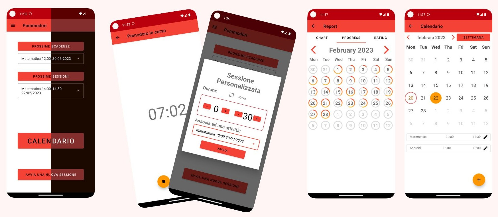

# Pommidori
Progetto di una applicazione Android per il corso Laboratorio di Programmazione per Sistemi Mobile e Tablet dell'univeristà di Trento.
Pommidori è un'applicazione per aiutare nella concentrazione durante lo studio, e per l'organizzazione del tempo.

